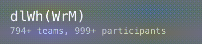

# Char Shuffling for React


`npm i shuffle-char -S` or `yarn add shuffle-char`

## Usage

```js
import Shuf from 'shuffle-char'
```

```jsx
<h1>
  <Shuf on={running} charset='a-zA-Z_' escape='()' idle={80}>Hack(FDU)</Shu>
</h1>
<h2>
  <Shuf on={running} charset='0-9' idle={80}>150</Shu>+ teams,
  <Shuf on={running} charset='0-9' idle={80}>500</Shu>+ participants
</h2>
```

## Demo



## API

Props supported:
- `on`: boolean,
    If `true` the animation will keep running, else it will display the default value.
- `charset`: string,
    `'a-z'` / `'A-Z'` / `'0-9'` + any characters. e.g. `'a-zA-Z_'` includes all alphabets and underscore.
- `escape`: string,
    Characters excluded from the `charset` above. e.g. `charset='a-z'` and `escape='x'` includes all lowercase letters exclude `x`.
- `idle`: number,
    The animation interval in ms.

## License

The MIT license.
